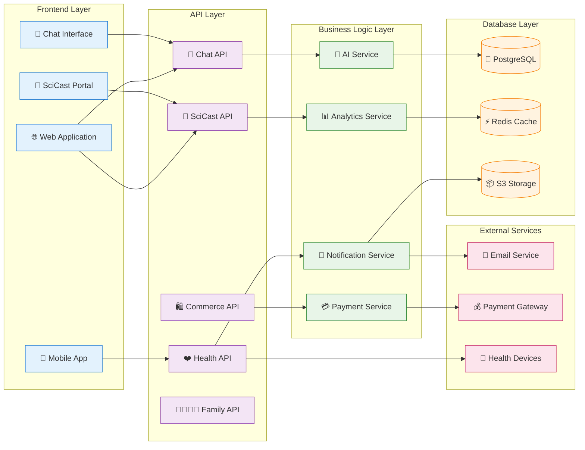
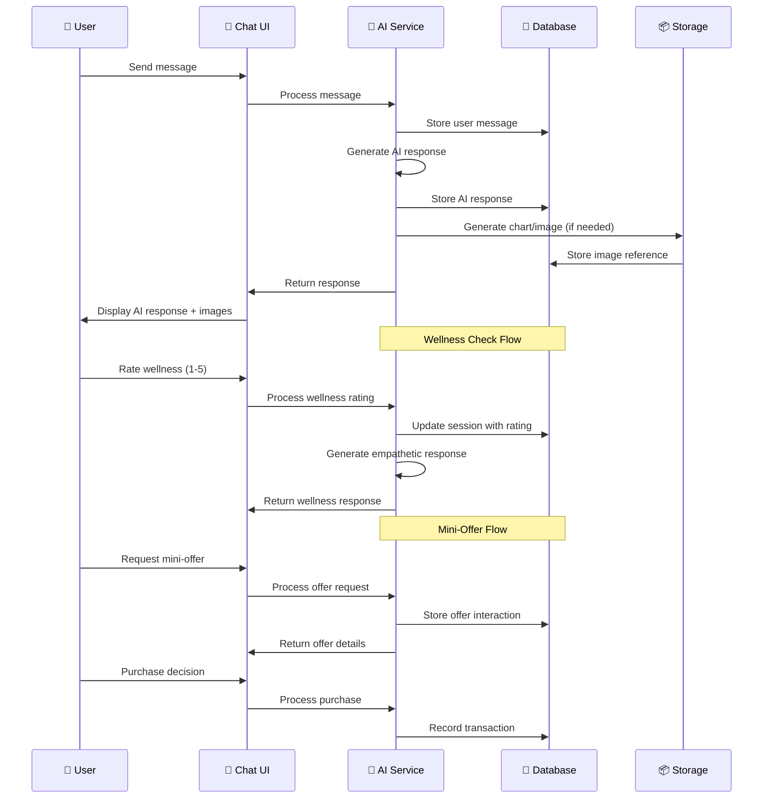
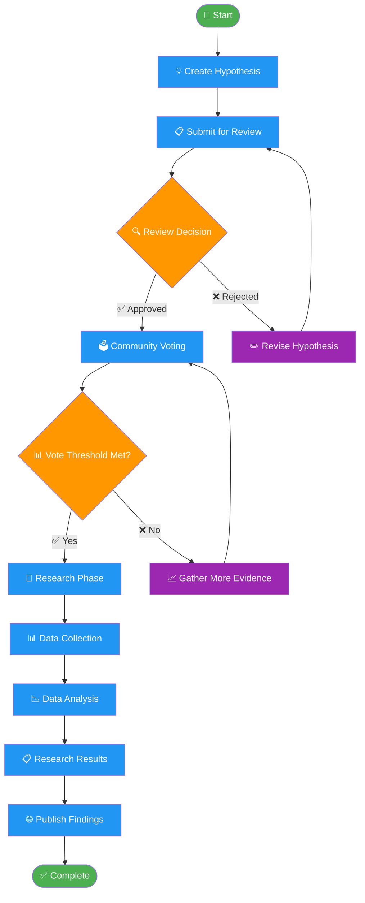
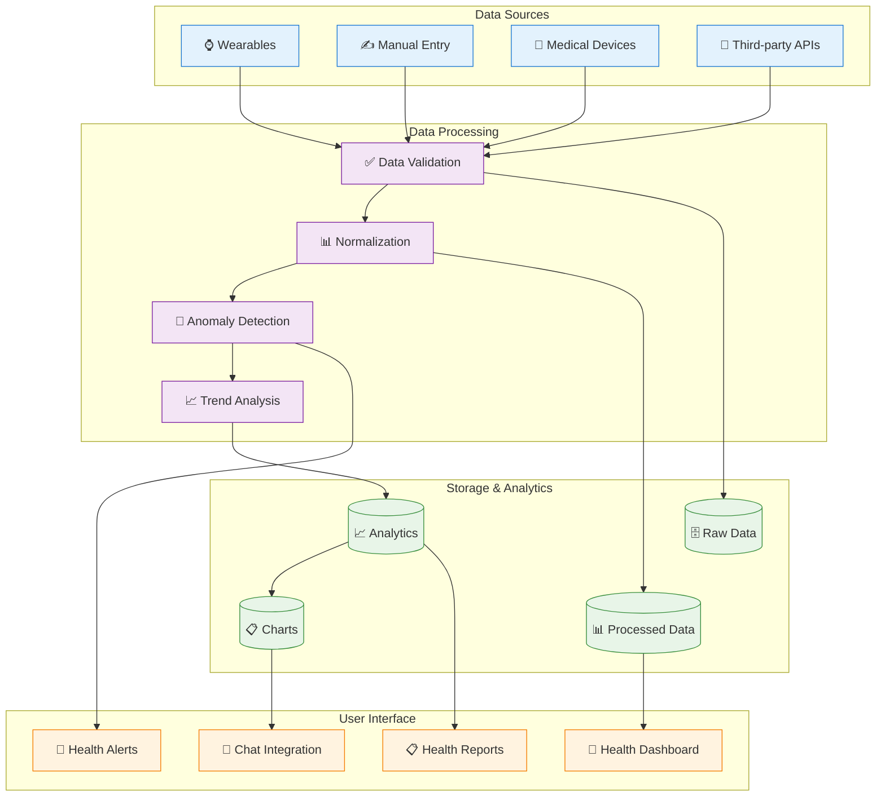

# InflammAI Database Architecture Diagram

## Visual Database Schema

```mermaid
graph TB
    %% Core User Tables
    Users["Users Table<br/>👤 User Profiles<br/>• user_id (PK)<br/>• email, username<br/>• subscription_plan<br/>• family_group_id<br/>• hipaa_consent"]
    
    %% Chat System Tables
    ChatSessions["ChatSessions<br/>💬 Chat Management<br/>• session_id (PK)<br/>• user_id (FK)<br/>• session_type<br/>• wellness_rating<br/>• sentiment_score"]
    
    ChatMessages["ChatMessages<br/>📝 Message Storage<br/>• message_id (PK)<br/>• session_id (FK)<br/>• content<br/>• message_type<br/>• ai_confidence"]
    
    ChatImages["ChatSessionImages<br/>🖼️ Chat Media<br/>• image_id (PK)<br/>• session_id (FK)<br/>• image_url<br/>• image_type<br/>• upload_source"]
    
    %% SciCast System Tables
    ScientificHypotheses["ScientificHypotheses<br/>🔬 Research Hub<br/>• hypothesis_id (PK)<br/>• creator_user_id (FK)<br/>• title, description<br/>• status<br/>• category"]
    
    HypothesisVotes["HypothesisVotes<br/>🗳️ Community Voting<br/>• vote_id (PK)<br/>• hypothesis_id (FK)<br/>• voter_user_id (FK)<br/>• vote_type<br/>• confidence_level"]
    
    HypothesisEvidence["HypothesisEvidence<br/>📋 Research Evidence<br/>• evidence_id (PK)<br/>• hypothesis_id (FK)<br/>• evidence_data (JSONB)<br/>• credibility_score"]
    
    HypothesisComments["HypothesisComments<br/>💭 Research Discussion<br/>• comment_id (PK)<br/>• hypothesis_id (FK)<br/>• commenter_user_id (FK)<br/>• content<br/>• comment_type"]
    
    %% Health & Wellness Tables
    HealthVitals["HealthVitals<br/>❤️ Health Tracking<br/>• vital_id (PK)<br/>• user_id (FK)<br/>• vital_type, value<br/>• measurement_method<br/>• is_abnormal"]
    
    VitalImages["VitalImages<br/>📊 Health Charts<br/>• image_id (PK)<br/>• vital_id (FK)<br/>• chart_type<br/>• data_points (JSONB)<br/>• time_range"]
    
    VitalAlerts["VitalAlerts<br/>🚨 Health Alerts<br/>• alert_id (PK)<br/>• user_id (FK)<br/>• alert_type<br/>• severity<br/>• message"]
    
    %% Commerce Tables
    WellnessKits["WellnessKits<br/>🛍️ Wellness Products<br/>• kit_id (PK)<br/>• kit_name, price<br/>• kit_category<br/>• supplier_name<br/>• is_approved"]
    
    KitItems["KitItems<br/>📦 Product Details<br/>• item_id (PK)<br/>• kit_id (FK)<br/>• item_name<br/>• quantity, unit<br/>• ingredients"]
    
    KitImages["KitImages<br/>📷 Product Photos<br/>• image_id (PK)<br/>• kit_id (FK)<br/>• image_url<br/>• image_type<br/>• is_primary"]
    
    MicroTransactions["MicroTransactions<br/>💳 Purchase History<br/>• transaction_id (PK)<br/>• user_id (FK)<br/>• item_id (FK)<br/>• total_amount<br/>• payment_status"]
    
    %% Family System Tables
    FamilyGroups["FamilyGroups<br/>👨‍👩‍👧‍👦 Family Groups<br/>• family_group_id (PK)<br/>• group_name<br/>• primary_member_id (FK)<br/>• max_members<br/>• subscription_plan"]
    
    FamilyMembers["FamilyMembers<br/>👥 Family Members<br/>• membership_id (PK)<br/>• family_group_id (FK)<br/>• user_id (FK)<br/>• role<br/>• permissions (JSONB)"]
    
    %% Relationships
    Users -->|has| ChatSessions
    Users -->|creates| ScientificHypotheses
    Users -->|votes on| HypothesisVotes
    Users -->|tracks| HealthVitals
    Users -->|purchases| MicroTransactions
    Users -->|belongs to| FamilyGroups
    
    ChatSessions -->|contains| ChatMessages
    ChatSessions -->|has images| ChatImages
    
    ScientificHypotheses -->|receives| HypothesisVotes
    ScientificHypotheses -->|has evidence| HypothesisEvidence
    ScientificHypotheses -->|has comments| HypothesisComments
    
    HealthVitals -->|generates| VitalImages
    HealthVitals -->|triggers| VitalAlerts
    
    WellnessKits -->|contains| KitItems
    WellnessKits -->|has photos| KitImages
    WellnessKits -->|sold in| MicroTransactions
    
    FamilyGroups -->|includes| FamilyMembers
    
    %% Styling
    classDef userTable fill:#e1f5fe,stroke:#01579b,stroke-width:2px
    classDef chatTable fill:#f3e5f5,stroke:#4a148c,stroke-width:2px
    classDef scicastTable fill:#e8f5e8,stroke:#1b5e20,stroke-width:2px
    classDef healthTable fill:#fff3e0,stroke:#e65100,stroke-width:2px
    classDef commerceTable fill:#fce4ec,stroke:#880e4f,stroke-width:2px
    classDef familyTable fill:#f1f8e9,stroke:#33691e,stroke-width:2px
    
    class Users userTable
    class ChatSessions,ChatMessages,ChatImages chatTable
    class ScientificHypotheses,HypothesisVotes,HypothesisEvidence,HypothesisComments scicastTable
    class HealthVitals,VitalImages,VitalAlerts healthTable
    class WellnessKits,KitItems,KitImages,MicroTransactions commerceTable
    class FamilyGroups,FamilyMembers familyTable
```

## System Architecture Overview

## Chat System Data Flow

## SciCast System Workflow

## Health Data Pipeline

## Key Database Relationships Summary

### Primary Relationships:
- **Users** → **ChatSessions** (1:N) - User chat sessions
- **Users** → **ScientificHypotheses** (1:N) - Created hypotheses
- **Users** → **HealthVitals** (1:N) - Health tracking data
- **Users** → **FamilyGroups** (N:1) - Family membership
- **ChatSessions** → **ChatMessages** (1:N) - Messages per session
- **ScientificHypotheses** → **HypothesisVotes** (1:N) - Votes per hypothesis
- **WellnessKits** → **MicroTransactions** (1:N) - Purchase history

### Critical Indexes:
- `users_email_idx` - Fast user lookup
- `chat_sessions_user_id_idx` - User session queries
- `hypotheses_status_idx` - Filter by approval status
- `health_vitals_user_measured_idx` - User health history
- `transactions_user_status_idx` - Purchase history

### Data Volume Estimates:
- **Chat Messages**: ~1M messages/month
- **Health Vitals**: ~10M readings/month
- **Hypotheses**: ~1K active hypotheses
- **Transactions**: ~10K purchases/month
- **Images**: ~50K images stored

This comprehensive database architecture supports all InflammAI features with scalability, performance, and HIPAA compliance in mind.
