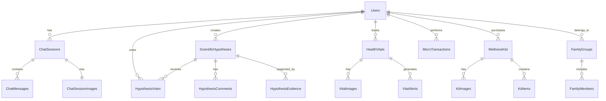

# InflammAI Database Structure

## Overview
This document outlines the complete database schema for the InflammAI application, with special focus on Chat functionality and SciCast (Scientific Casting/Hypothesis) features.

---

## Database Schema Diagram



---

## Core Tables

### 1. Users Table
```sql
CREATE TABLE Users (
    user_id UUID PRIMARY KEY DEFAULT gen_random_uuid(),
    email VARCHAR(255) UNIQUE NOT NULL,
    username VARCHAR(50) UNIQUE,
    password_hash VARCHAR(255) NOT NULL,
    first_name VARCHAR(100),
    last_name VARCHAR(100),
    avatar_url VARCHAR(500),
    subscription_plan VARCHAR(20) DEFAULT 'free', -- free, basic, premium, family
    subscription_status VARCHAR(20) DEFAULT 'active', -- active, cancelled, expired
    family_group_id UUID REFERENCES FamilyGroups(family_group_id),
    is_primary_family_member BOOLEAN DEFAULT false,
    hipaa_consent BOOLEAN DEFAULT false,
    data_export_consent BOOLEAN DEFAULT true,
    created_at TIMESTAMP DEFAULT CURRENT_TIMESTAMP,
    updated_at TIMESTAMP DEFAULT CURRENT_TIMESTAMP,
    last_login TIMESTAMP,
    is_active BOOLEAN DEFAULT true
);
```

### 2. Chat Sessions Table
```sql
CREATE TABLE ChatSessions (
    session_id UUID PRIMARY KEY DEFAULT gen_random_uuid(),
    user_id UUID NOT NULL REFERENCES Users(user_id),
    session_title VARCHAR(200),
    session_type VARCHAR(20) DEFAULT 'general', -- general, wellness_check, stress_tip, mini_offer
    started_at TIMESTAMP DEFAULT CURRENT_TIMESTAMP,
    ended_at TIMESTAMP,
    is_active BOOLEAN DEFAULT true,
    message_count INTEGER DEFAULT 0,
    sentiment_score DECIMAL(3,2), -- -1.00 to 1.00
    wellness_rating INTEGER, -- 1-5 scale from wellness checks
    session_summary TEXT,
    created_at TIMESTAMP DEFAULT CURRENT_TIMESTAMP,
    updated_at TIMESTAMP DEFAULT CURRENT_TIMESTAMP
);
```

### 3. Chat Messages Table
```sql
CREATE TABLE ChatMessages (
    message_id UUID PRIMARY KEY DEFAULT gen_random_uuid(),
    session_id UUID NOT NULL REFERENCES ChatSessions(session_id),
    message_type VARCHAR(20) NOT NULL, -- user, assistant, system
    content TEXT NOT NULL,
    message_category VARCHAR(30), -- text, image, wellness_check, mini_offer, stress_tip
    ai_response_confidence DECIMAL(3,2), -- 0.00 to 1.00
    processing_time_ms INTEGER,
    has_attachments BOOLEAN DEFAULT false,
    is_edited BOOLEAN DEFAULT false,
    created_at TIMESTAMP DEFAULT CURRENT_TIMESTAMP,
    updated_at TIMESTAMP DEFAULT CURRENT_TIMESTAMP
);
```

### 4. Chat Session Images Table
```sql
CREATE TABLE ChatSessionImages (
    image_id UUID PRIMARY KEY DEFAULT gen_random_uuid(),
    session_id UUID NOT NULL REFERENCES ChatSessions(session_id),
    message_id UUID REFERENCES ChatMessages(message_id),
    image_url VARCHAR(500) NOT NULL,
    image_type VARCHAR(20), -- chart, graph, illustration, photo
    alt_text TEXT,
    file_size_bytes INTEGER,
    mime_type VARCHAR(50),
    upload_source VARCHAR(20), -- user_upload, ai_generated, system_generated
    created_at TIMESTAMP DEFAULT CURRENT_TIMESTAMP
);
```

---

## SciCast (Scientific Hypothesis) Tables

### 5. Scientific Hypotheses Table
```sql
CREATE TABLE ScientificHypotheses (
    hypothesis_id UUID PRIMARY KEY DEFAULT gen_random_uuid(),
    creator_user_id UUID NOT NULL REFERENCES Users(user_id),
    title VARCHAR(300) NOT NULL,
    description TEXT NOT NULL,
    hypothesis_category VARCHAR(50), -- nutrition, exercise, sleep, mental_health, chronic_conditions
    target_condition VARCHAR(100), -- inflammation, diabetes, heart_disease, etc.
    methodology TEXT,
    expected_outcome TEXT,
    status VARCHAR(20) DEFAULT 'pending_approval', -- pending_approval, approved, rejected, completed
    approval_date TIMESTAMP,
    approver_user_id UUID REFERENCES Users(user_id),
    approval_notes TEXT,
    participant_count INTEGER DEFAULT 0,
    completion_percentage DECIMAL(5,2) DEFAULT 0.00,
    research_phase VARCHAR(20) DEFAULT 'hypothesis', -- hypothesis, testing, analysis, completed
    created_at TIMESTAMP DEFAULT CURRENT_TIMESTAMP,
    updated_at TIMESTAMP DEFAULT CURRENT_TIMESTAMP
);
```

### 6. Hypothesis Votes Table
```sql
CREATE TABLE HypothesisVotes (
    vote_id UUID PRIMARY KEY DEFAULT gen_random_uuid(),
    hypothesis_id UUID NOT NULL REFERENCES ScientificHypotheses(hypothesis_id),
    voter_user_id UUID NOT NULL REFERENCES Users(user_id),
    vote_type VARCHAR(10) NOT NULL, -- up, down, neutral
    confidence_level INTEGER, -- 1-5 scale
    reasoning TEXT,
    created_at TIMESTAMP DEFAULT CURRENT_TIMESTAMP,
    UNIQUE(hypothesis_id, voter_user_id)
);
```

### 7. Hypothesis Evidence Table
```sql
CREATE TABLE HypothesisEvidence (
    evidence_id UUID PRIMARY KEY DEFAULT gen_random_uuid(),
    hypothesis_id UUID NOT NULL REFERENCES ScientificHypotheses(hypothesis_id),
    contributor_user_id UUID REFERENCES Users(user_id),
    evidence_type VARCHAR(30), -- study, data_point, observation, citation
    evidence_data JSONB, -- Flexible structure for different evidence types
    source_url VARCHAR(500),
    credibility_score DECIMAL(3,2), -- 0.00 to 1.00
    is_verified BOOLEAN DEFAULT false,
    created_at TIMESTAMP DEFAULT CURRENT_TIMESTAMP,
    updated_at TIMESTAMP DEFAULT CURRENT_TIMESTAMP
);
```

### 8. Hypothesis Comments Table
```sql
CREATE TABLE HypothesisComments (
    comment_id UUID PRIMARY KEY DEFAULT gen_random_uuid(),
    hypothesis_id UUID NOT NULL REFERENCES ScientificHypotheses(hypothesis_id),
    commenter_user_id UUID NOT NULL REFERENCES Users(user_id),
    parent_comment_id UUID REFERENCES HypothesisComments(comment_id), -- For nested comments
    content TEXT NOT NULL,
    comment_type VARCHAR(20) DEFAULT 'discussion', -- discussion, question, feedback, update
    is_moderated BOOLEAN DEFAULT false,
    moderator_user_id UUID REFERENCES Users(user_id),
    created_at TIMESTAMP DEFAULT CURRENT_TIMESTAMP,
    updated_at TIMESTAMP DEFAULT CURRENT_TIMESTAMP
);
```

---

## Health & Wellness Tables

### 9. Health Vitals Table
```sql
CREATE TABLE HealthVitals (
    vital_id UUID PRIMARY KEY DEFAULT gen_random_uuid(),
    user_id UUID NOT NULL REFERENCES Users(user_id),
    vital_type VARCHAR(30) NOT NULL, -- heart_rate, blood_pressure, glucose, weight, temperature, oxygen_saturation
    value DECIMAL(10,4) NOT NULL,
    unit VARCHAR(20) NOT NULL, -- bpm, mmHg, mg/dL, kg, °F, %
    measurement_method VARCHAR(30), -- manual, wearable, device, manual_entry
    device_source VARCHAR(100), -- apple_watch, fitbit, omron, etc.
    quality_score DECIMAL(3,2), -- 0.00 to 1.00
    is_abnormal BOOLEAN DEFAULT false,
    notes TEXT,
    measured_at TIMESTAMP NOT NULL,
    created_at TIMESTAMP DEFAULT CURRENT_TIMESTAMP,
    updated_at TIMESTAMP DEFAULT CURRENT_TIMESTAMP
);
```

### 10. Vital Images Table
```sql
CREATE TABLE VitalImages (
    image_id UUID PRIMARY KEY DEFAULT gen_random_uuid(),
    vital_id UUID NOT NULL REFERENCES HealthVitals(vital_id),
    image_url VARCHAR(500) NOT NULL,
    image_type VARCHAR(20), -- chart, graph, trend, comparison
    chart_type VARCHAR(30), -- line_chart, bar_chart, scatter_plot, heatmap
    time_range VARCHAR(20), -- daily, weekly, monthly, yearly
    data_points JSONB, -- Chart data points
    generated_by VARCHAR(20), -- system, user, ai
    created_at TIMESTAMP DEFAULT CURRENT_TIMESTAMP
);
```

### 11. Vital Alerts Table
```sql
CREATE TABLE VitalAlerts (
    alert_id UUID PRIMARY KEY DEFAULT gen_random_uuid(),
    user_id UUID NOT NULL REFERENCES Users(user_id),
    vital_id UUID REFERENCES HealthVitals(vital_id),
    alert_type VARCHAR(30) NOT NULL, -- critical, warning, trend, anomaly
    severity VARCHAR(10) NOT NULL, -- low, medium, high, critical
    message TEXT NOT NULL,
    is_read BOOLEAN DEFAULT false,
    is_resolved BOOLEAN DEFAULT false,
    resolution_notes TEXT,
    created_at TIMESTAMP DEFAULT CURRENT_TIMESTAMP,
    resolved_at TIMESTAMP
);
```

---

## Commerce & Micro-Transactions Tables

### 12. Wellness Kits Table
```sql
CREATE TABLE WellnessKits (
    kit_id UUID PRIMARY KEY DEFAULT gen_random_uuid(),
    kit_name VARCHAR(200) NOT NULL,
    kit_description TEXT,
    kit_category VARCHAR(50), -- supplements, fitness, mental_health, recovery
    price DECIMAL(10,2) NOT NULL,
    is_active BOOLEAN DEFAULT true,
    is_approved BOOLEAN DEFAULT true,
    supplier_name VARCHAR(100),
    supplier_url VARCHAR(500),
    inventory_count INTEGER DEFAULT 0,
    average_rating DECIMAL(3,2),
    review_count INTEGER DEFAULT 0,
    created_at TIMESTAMP DEFAULT CURRENT_TIMESTAMP,
    updated_at TIMESTAMP DEFAULT CURRENT_TIMESTAMP
);
```

### 13. Kit Items Table
```sql
CREATE TABLE KitItems (
    item_id UUID PRIMARY KEY DEFAULT gen_random_uuid(),
    kit_id UUID NOT NULL REFERENCES WellnessKits(kit_id),
    item_name VARCHAR(200) NOT NULL,
    item_description TEXT,
    quantity INTEGER NOT NULL,
    unit VARCHAR(20), -- pills, grams, ml, units
    dosage_instructions TEXT,
    ingredients TEXT,
    allergen_warnings TEXT,
    created_at TIMESTAMP DEFAULT CURRENT_TIMESTAMP
);
```

### 14. Kit Images Table
```sql
CREATE TABLE KitImages (
    image_id UUID PRIMARY KEY DEFAULT gen_random_uuid(),
    kit_id UUID NOT NULL REFERENCES WellnessKits(kit_id),
    image_url VARCHAR(500) NOT NULL,
    image_type VARCHAR(20), -- product_photo, lifestyle, infographic, chart
    is_primary BOOLEAN DEFAULT false,
    alt_text TEXT,
    display_order INTEGER DEFAULT 0,
    created_at TIMESTAMP DEFAULT CURRENT_TIMESTAMP
);
```

### 15. Micro-Transactions Table
```sql
CREATE TABLE MicroTransactions (
    transaction_id UUID PRIMARY KEY DEFAULT gen_random_uuid(),
    user_id UUID NOT NULL REFERENCES Users(user_id),
    transaction_type VARCHAR(30) NOT NULL, -- kit_purchase, supplement, report, premium_feature
    item_id UUID, -- References WellnessKits.kit_id or other item tables
    item_name VARCHAR(200) NOT NULL,
    quantity INTEGER DEFAULT 1,
    unit_price DECIMAL(10,2) NOT NULL,
    total_amount DECIMAL(10,2) NOT NULL,
    currency VARCHAR(3) DEFAULT 'USD',
    payment_method VARCHAR(30), -- credit_card, paypal, crypto, wallet
    payment_status VARCHAR(20) DEFAULT 'pending', -- pending, completed, failed, refunded
    transaction_reference VARCHAR(100),
    chat_session_id UUID REFERENCES ChatSessions(session_id), -- Link to chat where purchase was made
    created_at TIMESTAMP DEFAULT CURRENT_TIMESTAMP,
    completed_at TIMESTAMP
);
```

---

## Family & Groups Tables

### 16. Family Groups Table
```sql
CREATE TABLE FamilyGroups (
    family_group_id UUID PRIMARY KEY DEFAULT gen_random_uuid(),
    group_name VARCHAR(200) NOT NULL,
    primary_member_id UUID NOT NULL REFERENCES Users(user_id),
    max_members INTEGER DEFAULT 6,
    subscription_plan VARCHAR(20) DEFAULT 'family',
    is_active BOOLEAN DEFAULT true,
    created_at TIMESTAMP DEFAULT CURRENT_TIMESTAMP,
    updated_at TIMESTAMP DEFAULT CURRENT_TIMESTAMP
);
```

### 17. Family Members Table
```sql
CREATE TABLE FamilyMembers (
    membership_id UUID PRIMARY KEY DEFAULT gen_random_uuid(),
    family_group_id UUID NOT NULL REFERENCES FamilyGroups(family_group_id),
    user_id UUID NOT NULL REFERENCES Users(user_id),
    role VARCHAR(20) DEFAULT 'member', -- primary, admin, member, viewer
    permissions JSONB, -- Granular permissions for health data access
    joined_at TIMESTAMP DEFAULT CURRENT_TIMESTAMP,
    is_active BOOLEAN DEFAULT true
);
```

---

## Illustrations & Media Assets

### Chat Section Illustrations

#### 1. Wellness Check Illustrations
```
/wellness-check/
├── wellness-hero-illustration.svg          # Main wellness check visual
├── rating-scales/
│   ├── scale-1-very-low.svg               # Sad/low energy character
│   ├── scale-2-low.svg                    # Concerned character
│   ├── scale-3-neutral.svg                # Neutral/okay character
│   ├── scale-4-good.svg                   # Happy character
│   └── scale-5-great.svg                  # Excited/energetic character
├── wellness-tips/
│   ├── breathing-exercise.svg             # 4-2-6 breathing technique
│   ├── calming-activity.svg               # Meditation/stretching
│   ├── mood-lifter.svg                    # Energy boost activity
│   └── health-momentum.svg                # Maintaining good mood
└── response-illustrations/
    ├── empathy-low.svg                    # Supportive response for low ratings
    ├── encouragement-medium.svg           # Encouragement for medium ratings
    └── celebration-high.svg               # Celebration for high ratings
```

#### 2. Mini-Offers Illustrations
```
/mini-offers/
├── relax-pack-illustration.svg           # Main Relax Pack product visual
├── transaction-states/
│   ├── offer-presentation.svg            # Presenting the offer
│   ├── purchase-success.svg              # Successful transaction
│   └── purchase-terminated.svg            # Cancelled transaction
└── product-icons/
    ├── relax-icon.svg                    # Relaxation themed icon
    ├── wellness-icon.svg                 # General wellness icon
    └── premium-badge.svg                 # Premium offer indicator
```

#### 3. Stress Tip Illustrations
```
/stress-tips/
├── breathing-technique.svg               # 4-2-6 breathing visual guide
├── stress-relief-icons/
│   ├── inhale-icon.svg                   # Inhale animation frame
│   ├── hold-icon.svg                     # Hold breath frame
│   └── exhale-icon.svg                   # Exhale animation frame
└── guided-session/
    ├── session-start.svg                 # Beginning of guided session
    ├── session-progress.svg              # During breathing exercise
    └── session-complete.svg              # Completion illustration
```

### SciCast Section Illustrations

#### 1. Hypothesis Creation
```
/scicast/hypothesis/
├── create-hypothesis-illustration.svg    # Main creation visual
├── hypothesis-types/
│   ├── nutrition-hypothesis.svg          # Nutrition research icon
│   ├── exercise-hypothesis.svg           # Exercise research icon
│   ├── sleep-hypothesis.svg             # Sleep research icon
│   ├── mental-health-hypothesis.svg     # Mental health research icon
│   └── chronic-condition-hypothesis.svg # Chronic condition research icon
└── process-flow/
    ├── idea-generation.svg              # Initial idea stage
    ├── hypothesis-formulation.svg       # Writing hypothesis
    ├── peer-review.svg                  # Community review process
    └── approval-status.svg              # Approved/Rejected status
```

#### 2. Voting & Participation
```
/scicast/voting/
├── voting-interface-illustration.svg    # Main voting visual
├── vote-types/
│   ├── upvote-illustration.svg           # Positive vote visual
│   ├── downvote-illustration.svg         # Negative vote visual
│   └── neutral-vote-illustration.svg    # Neutral vote visual
├── confidence-levels/
│   ├── confidence-1.svg                 # Very low confidence
│   ├── confidence-2.svg                 # Low confidence
│   ├── confidence-3.svg                 # Medium confidence
│   ├── confidence-4.svg                 # High confidence
│   └── confidence-5.svg                 # Very high confidence
└── participation-metrics/
    ├── community-engagement.svg         # Overall participation
    ├── hypothesis-popularity.svg        # Popular hypotheses
    └── contribution-impact.svg          # User impact visualization
```

#### 3. Research Progress
```
/scicast/research/
├── research-phases-illustration.svg     # Research lifecycle visual
├── phase-indicators/
│   ├── hypothesis-phase.svg             # Initial hypothesis stage
│   ├── testing-phase.svg                # Data collection/testing
│   ├── analysis-phase.svg               # Data analysis
│   └── completion-phase.svg             # Completed research
├── data-visualization/
│   ├── trend-analysis.svg               # Trend charts
│   ├── correlation-graph.svg            # Correlation visualizations
│   ├── statistical-significance.svg     # Statistical indicators
│   └── evidence-strength.svg            # Evidence strength indicators
└── collaboration/
    ├── researcher-network.svg           # Researcher collaboration
    ├── peer-review-process.svg          # Review workflow
    └── community-contribution.svg       # Community input
```

---

## Data Visualization Charts

### Chat Analytics Charts
```
/chat-analytics/
├── sentiment-analysis.svg               # Chat sentiment over time
├── wellness-trends.svg                  # Wellness rating trends
├── engagement-metrics.svg               # User engagement patterns
├── topic-distribution.svg              # Chat topic distribution
└── response-quality.svg                # AI response quality metrics
```

### SciCast Analytics Charts
```
/scicast-analytics/
├── hypothesis-popularity.svg            # Most popular hypotheses
├── voting-patterns.svg                  # Voting behavior analysis
├── research-progress.svg                # Overall research progress
├── community-engagement.svg             # Community participation metrics
└── success-metrics.svg                  # Hypothesis success rates
```

---

## Implementation Notes

### Image Optimization
- All SVG illustrations should be optimized for web delivery
- Implement lazy loading for non-critical images
- Use WebP format for photographic images with fallbacks
- Implement responsive images with srcset for different screen sizes

### Database Performance
- Add appropriate indexes on frequently queried columns
- Implement database connection pooling
- Use read replicas for analytics queries
- Implement caching for frequently accessed data

### Security Considerations
- All user data should be encrypted at rest
- Implement HIPAA compliance measures
- Use parameterized queries to prevent SQL injection
- Implement proper access controls for family health data

### Scalability
- Design for horizontal scaling
- Implement database sharding for large datasets
- Use CDN for image and asset delivery
- Implement API rate limiting for chat endpoints

---

## API Endpoints Reference

### Chat Endpoints
```
POST   /api/chat/sessions              # Create new chat session
GET    /api/chat/sessions              # List user sessions
GET    /api/chat/sessions/:id          # Get session details
POST   /api/chat/sessions/:id/messages # Send message
GET    /api/chat/sessions/:id/messages # Get session messages
POST   /api/chat/sessions/:id/images   # Upload chat image
GET    /api/chat/analytics              # Chat analytics data
```

### SciCast Endpoints
```
POST   /api/scicast/hypotheses         # Create hypothesis
GET    /api/scicast/hypotheses         # List hypotheses
GET    /api/scicast/hypotheses/:id     # Get hypothesis details
POST   /api/scicast/hypotheses/:id/votes # Vote on hypothesis
POST   /api/scicast/hypotheses/:id/evidence # Add evidence
GET    /api/scicast/analytics           # SciCast analytics
```

This database structure provides a comprehensive foundation for the InflammAI application with robust support for chat functionality, scientific hypothesis collaboration, health tracking, and e-commerce features.
